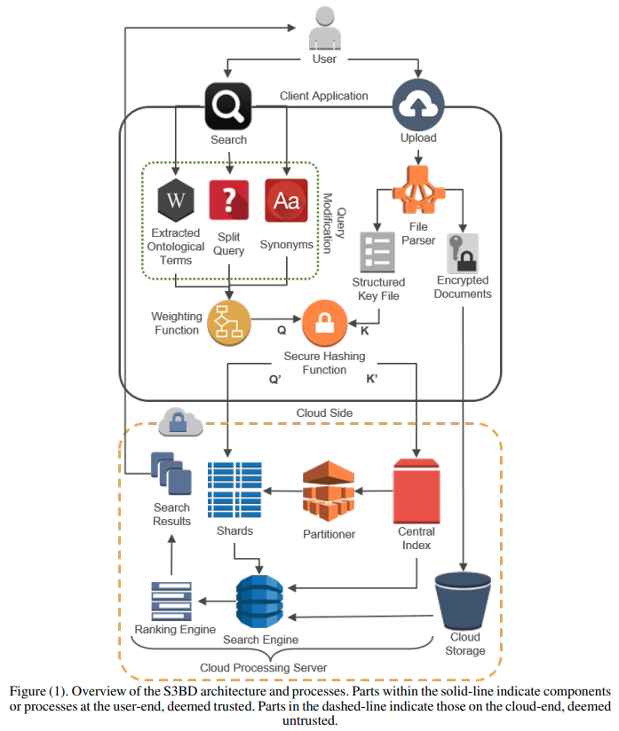

# Secure Semantic Search over Encrypted Big data in the Cloud (S3BD)

## Introduction
This is an open-source program that enables semantic enterprise search for unstructured encrypted big datasets stored in the cloud. 
If you are using this tool in your research projects, please cite the following paper:
```
@article{woodworth2019s3bd,
  title={S3BD: Secure semantic search over encrypted big data in the cloud},
  author={Woodworth, Jason W and Amini Salehi, Mohsen},
  journal={Concurrency and Computation: Practice and Experience},
  volume={31},
  number={11},
  pages={e5050},
  year={2019},
  publisher={Wiley Online Library}
}
```
The paper is also available in the following address:
http://hpcclab.org/paperPdf/ccpe19/surveyccpe19.pdf
## Architecture
<p align="center"></p>


## S3BD Running Instructions

S3BD is composed of two projects named Client Encrypted Search and Encrypted Search Server that act as client and cloud respectively.  
These two can be run on the same machine, or on two machines connected by a network.  There are three primary actions you can perform when running the system: Uploading documents, Partitioning the dataset into clusters, and Searching over the dataset.

## Uploading Documents

To start an upload, launch the cloud server and select upload as its action (the ``` -u ``` flag), and choose how they'll be uploaded based on your project configuration (``` -f ``` for cloud and client being on the same machine, ``` -n ``` for them being remote). Alternatively, launch the project from the command line with the two flags following as arguments.

Once the server is running, launch the client and select upload as its action (again, the ``` -u ``` flag).  To perform a batch upload, enter the path for the directory with the files.  Alternatively, run it in the commandline with ``` -u ``` and the path following as arguments.  Single file uploads are not currently supported.

## Partitioning Dataset

To start partitioning the dataset, launch the cloud server and select partition as its action (the ``` -p ``` flag).  The process will start automatically.  The console will display the progress of the partitioning.  Once the console notes that it is ready to connect to the client, launch the client, select partitioning as its action, and the files will be transferred.

## Searching

To start a search, launch the cloud server and select search as its action (the ``` -s ``` flag).  The cloud will begin loading relevant data.

Once the server is ready to accept a search, launch the client and select search as its action, then enter the desired search query.  The client's console should soon show the results of the search.

## Configuration details.

The config files for each project can be found in the utilities subdirectory of the src directory.  Most importantly:

### Client Project

  * cloudIP - the IP used to connect to the server. Use localhost if both projects are local.
  * socketPort - the socket used for data transfers. Ensure this is the same on both client and cloud.
  * calcMetrics - only set this to true if you are testing speeds.
  * numSearchedAbstracts - determines the number of abstracts and clusters that should be searched over.  Has a heavy impact on speed and accuracy.
  
### Cloud Project

  * socketPort - the socket used for data transfers.  Ensure this is the same on both client and cloud.
  * abstractIndexCound - the number of terms that will be included in an abstract index.
  * k - the number of clusters created during partitioning.
  * calcMetrics - only set this to true if you are testing speeds.
<<<<<<< HEAD

##
=======
  
 ## Acknowledgements
 This project is derived from Jason Woodworth Master's thesis. In addition to the code base, the project includes his thesis latex files too.
>>>>>>> 8bb62e93644df19a61a25b9b6e05b4956af8f366
